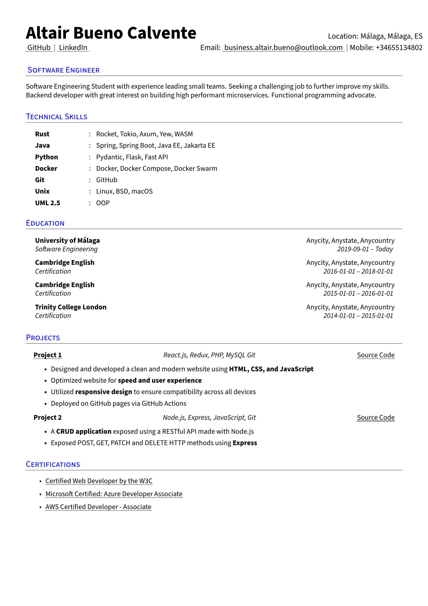

# Resume

Altair's resume



# Building

## Required software

- A LaTeX distribution
- GNU Make
- Arial Font
- [Poetry](https://python-poetry.org/)

## Building the resume

This project uses GNU MakeFile to simplify the building process of the resume.
The quickest way to build the resume from scratch is to run `make all`. This
will install the required dependencies and build the PDF

## MakeFile command list

```bash
# Install dependencies
make deps
# Build the resume
make resume
# Generate the resume thumbnail (requires poppler)
make thumbnail
# Install dependencies and build
make all
# Cleanup
make clean
```

# License

All software is licensed under the MIT license ([license](LICENSE)), except for
the [LaTeX template](templates/README.md#license). All the data belongs to
Altair Bueno
